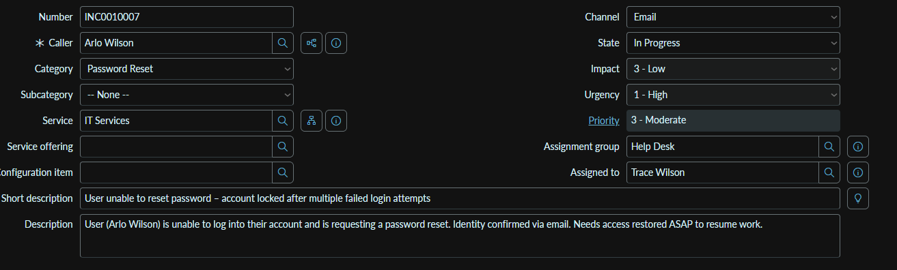

# Home Lab: ServiceNow Ticketing + Active Directory

This is my home lab project where I practice handling real support tickets
in ServiceNow and resolving them against my Active Directory domain
(ENTERPRIZE.COM). I'm using ServiceNow to receive requests and my Windows
Server 2025 domain controller to actually fix them.

## My setup

- Ticketing tool: ServiceNow
- Domain controller: Windows Server 2025 Datacenter, EC2AMAZ-E3K8IDE
- Domain: ENTERPRIZE.COM
- Access method: Remote Desktop Connection

## What I did

### 1. Getting the ticket

Incident INC0010007 came in through ServiceNow, submitted by Arlo Wilson,
category "Password Reset." He'd been trying to log in for 30 minutes,
requested a password reset link three times, and never got an email, even
after checking spam. He'd been a user for two years and said this had never
happened before, so he wanted it looked at the same day.

### 2. Resolving it in Active Directory

I went into Active Directory Users and Computers, found Arlo Wilson's
account under Engineering, and used Reset Password instead of relying on
the self-service email link, since that clearly wasn't going through. I
checked "User must change password at next logon" so he'd set his own new
password on his next login, and confirmed his account wasn't locked out on
the domain controller before closing out the ticket.

## Things I learned

- Self-service password reset emails can fail silently, so it's worth
  checking the account status directly in AD instead of just assuming the
  user did something wrong.
- Forcing a password change at next logon is a good habit when I'm the one
  setting a temporary password, so the user ends up with something only
  they know.
- Checking the Account Lockout Status while I'm already in the reset dialog
  saves a step, since a locked account can look identical to a reset issue
  from the user's side.

## Note

This is just a personal lab for learning. No real company info or
credentials are in here.
